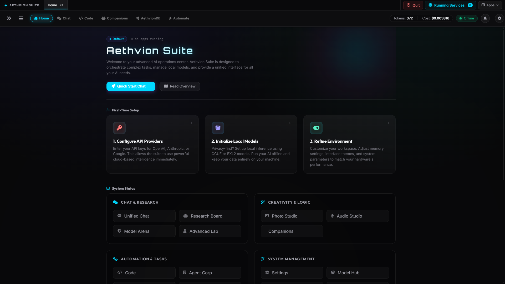
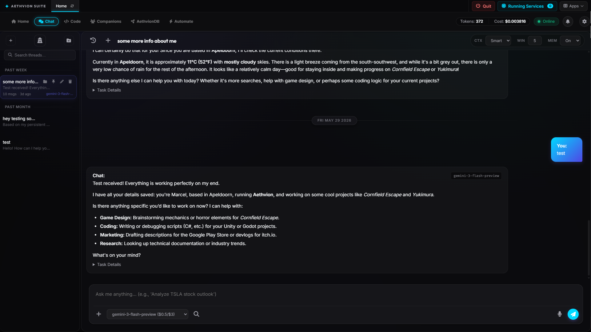
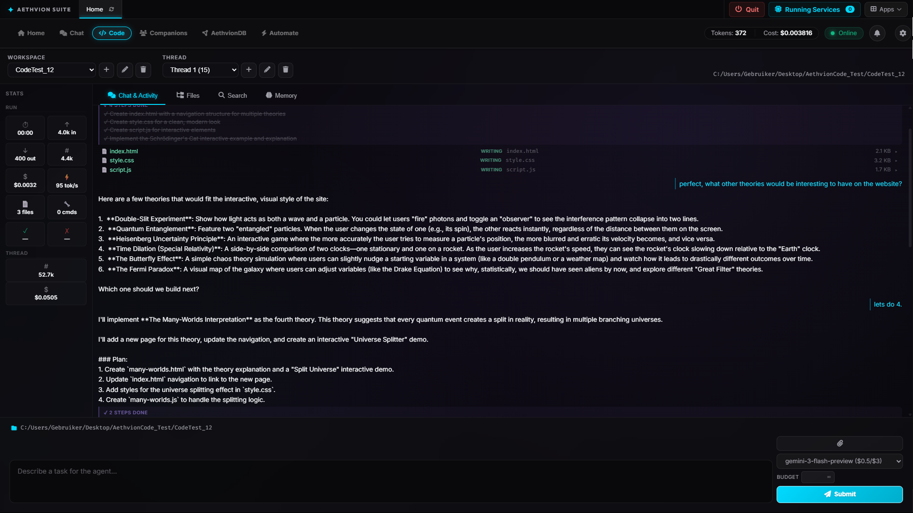
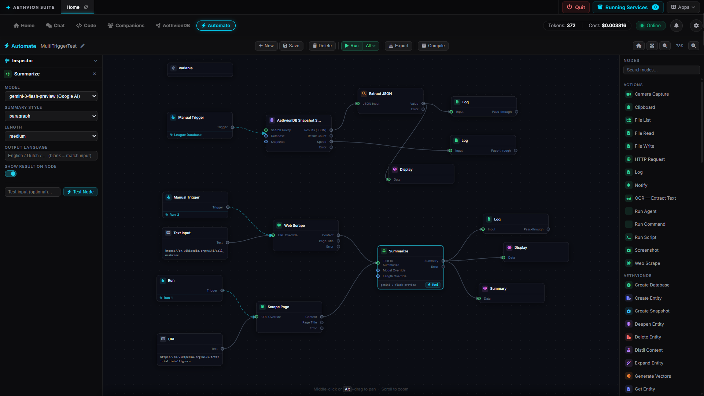
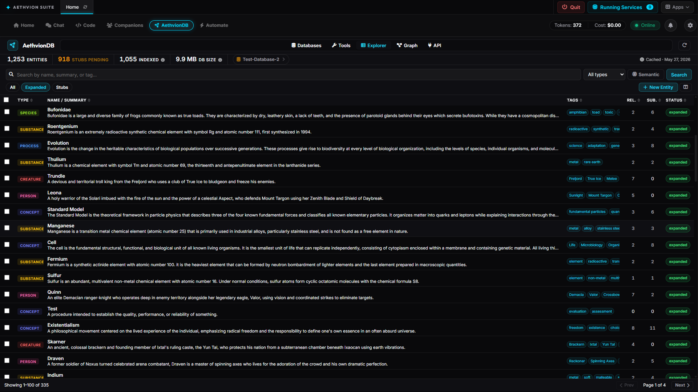

<div align="center">

# Aethvion Suite

**A self-hosted AI platform built around four core tools:**<br>
**Chat · Code · Automate · AethvionDB**

[](https://www.python.org/downloads/)
[](LICENSE)
[](https://github.com/sponsors/Aethvion)

[Documentation](https://github.com/Aethvion/Aethvion-Suite/tree/main/docs) · [Getting Started](https://github.com/Aethvion/Aethvion-Suite/blob/main/docs/human/getting-started.md) · [Discussions](https://github.com/Aethvion/Aethvion-Suite/discussions)

</div>

---

<div align="center">

</div>

---

Aethvion Suite is a **self-hosted AI platform** that runs on your machine. It connects to cloud AI providers — Gemini, GPT-4o, Claude, Grok — or runs entirely on local models. Your data stays where you put it.

The platform is built around four tools that work together: a persistent AI chat environment, an autonomous code agent, a visual workflow builder, and a structured personal knowledge base.

---

## The Four Tools

### 💬 Chat

A multi-model AI chat environment with persistent context and companion-style memory.

Each conversation thread keeps its own history. Companions — AI characters with defined personalities and memory — remember preferences, facts, and past conversations across sessions. Context carries forward automatically: what you told the system last week is available today.

Chat routes across all configured providers with automatic failover. If your primary model is unavailable, the next in your priority list picks up transparently.

<div align="center">

</div>

---

### ⚡ Code

An autonomous code agent that reads, writes, and iterates on real files in your project.

The Code agent operates on a workspace directory. It can read files, apply precise patch operations, run shell commands, search the codebase, and verify its own changes — all in a multi-step loop without manual intervention. Each step streams live to the interface.

Project memory persists across sessions: the agent retains a structured understanding of your codebase, reducing redundant reads and keeping context tight over long tasks.

<div align="center">

</div>

---

### 🔄 Automate

A visual node-based workflow builder for constructing AI-powered pipelines.

Workflows are built by connecting nodes on a canvas. Node types span AI calls, data transforms, file operations, web requests, OCR, screen capture, AethvionDB queries, notifications, and external integrations. Workflows can be triggered manually, on a schedule, or via webhook.

Finished workflows compile to standalone bundles — a single Python file with no Aethvion dependency — that can run anywhere.

<div align="center">

</div>

---

### 🗄️ AethvionDB

A structured personal knowledge base designed to work alongside AI workflows.

Data is organised as typed entities — people, projects, concepts, events — stored with semantic embeddings for natural-language search. Relationships between entities form a queryable graph. Entities can be baked into snapshot datasets for use in Automate workflows or external pipelines.

AethvionDB is queryable from the Automate node editor, from Chat, and from the Code agent. It functions as a shared knowledge layer across the entire platform.

<div align="center">

</div>

---

## Model Architecture

Aethvion Suite treats every AI call — chat, code, automation, image generation — as a routed request through a single provider layer.

```
Request → Provider Manager → Priority Queue → [Provider A] → Response
                                            ↓ (if unavailable)
                                            [Provider B] → Response
                                            ↓ (if unavailable)
                                            [Local Model] → Response
```

**Cloud providers** (configure via `.env`):

| Provider | Models |
|---|---|
| Google AI | Gemini 2.0 Flash, Gemini 1.5 Pro, Imagen 3 |
| OpenAI | GPT-4o, DALL-E 3 |
| Anthropic | Claude 3.5 Sonnet, Claude 3 Opus |
| xAI | Grok |
| Groq | Llama 3, Mixtral (fast inference) |
| Mistral | Mistral Large, Codestral |
| OpenRouter | Any model via the OpenRouter gateway |

**Local models** — no API key, no external calls:

| Runtime | What runs |
|---|---|
| llama.cpp | Any GGUF model (Llama, Mistral, Phi, Qwen, etc.) |
| Ollama | Any Ollama-served model |

Switching between a cloud model and a local one requires no code change. Add a local model in the Model Hub, set its position in the priority list, and the router uses it. If a provider returns an authentication error or rate-limit response, it is marked offline for the session and the next provider in the list takes over.

**Intelligence Firewall** sits in front of every outbound request. It scans for credentials, PII, and sensitive patterns before any data leaves the machine. Sensitive content is flagged and blocked; the rest passes through.

---

## Quick Start

**Windows (one click):**
```
Start_Aethvion.bat
```
Creates a virtual environment, installs dependencies, and opens the dashboard. Subsequent launches use the cached environment and start in under 10 seconds.

**Manual:**
```bash
git clone https://github.com/Aethvion/Aethvion-Suite.git
cd Aethvion-Suite
pip install -e ".[dev]"
cp .env.example .env      # Windows: copy .env.example .env
python -m core.main
```

Open [http://localhost:8080](http://localhost:8080).

**Minimum configuration:** Add at least one API key to `.env`, or place a GGUF model in `localmodels/gguf/` to run without any cloud dependency.

```env
# .env — add any one or more
GOOGLE_AI_API_KEY=...
OPENAI_API_KEY=...
ANTHROPIC_API_KEY=...
GROQ_API_KEY=...
```

---

## Sponsors

<div align="center">

Aethvion Suite is built and maintained independently.<br>
If it saves you time, consider supporting its development.

[Become a Sponsor](https://github.com/sponsors/Aethvion)

</div>

---

## License

[AGPL-3.0](LICENSE) — free for personal and open-source use.
A separate commercial license is available for proprietary deployments. See [COMMERCIAL_LICENSE.md](COMMERCIAL_LICENSE.md).

---

<div align="center">

[GitHub](https://github.com/Aethvion/Aethvion-Suite) · [Issues](https://github.com/Aethvion/Aethvion-Suite/issues) · [Discussions](https://github.com/Aethvion/Aethvion-Suite/discussions)

</div>
