# Project Mapper Token Efficiency Report: Django Codebase

This report evaluates the token efficiency and context optimization of using **Project Mapper** versus traditional filesystem search/read techniques on the **Django** codebase.

---

## 📋 Scenario: Understanding the Django Middleware System

We simulated a typical developer/agent onboarding task:
> **Task**: Locate the core middleware loading and chaining logic in Django, identify which handler classes extend or call it, and trace the path from base handlers to WSGI/ASGI handlers.

---

## 🔍 Approach A: Traditional Workspace Tools (No Project Mapper)

Without Project Mapper, an agent relies on full-text searches and whole-file reads to build a mental map of the architecture.

### Step-by-Step Workflow & Token Costs

| Step | Action | Tool Used | Content Retrieved | Approx. Token Count |
| :--- | :--- | :--- | :--- | :--- |
| **1** | Locate class `BaseHandler` or method `load_middleware` | `grep_search` or manual search | Search results listing locations | **~500 tokens** |
| **2** | View main handler code | `view_file` on `django/core/handlers/base.py` | Full file (376 lines, 15.2 KB) | **~3,800 tokens** |
| **3** | View exception wrappers | `view_file` on `django/core/handlers/exception.py` | Full file (130 lines, 6.1 KB) | **~1,500 tokens** |
| **4** | Trace WSGI usage | `view_file` on `django/core/handlers/wsgi.py` | Full file (180 lines, 7.5 KB) | **~1,900 tokens** |
| **5** | Trace ASGI usage | `view_file` on `django/core/handlers/asgi.py` | Full file (310 lines, 14.2 KB) | **~3,600 tokens** |
| **Total**| **Single-turn Ingestion** | — | **43.0 KB of raw code** | **~11,300 tokens** |

> [!WARNING]
> In a typical agent workflow, this **11,300-token payload** becomes part of the conversation history. Over a **10-turn conversation**, the model repeatedly processes the history, accumulating **~113,000 token-turns** of processing cost.

---

## ⚡ Approach B: Using Project Mapper

With Project Mapper, the agent queries the pre-computed AST knowledge graph to obtain precise relations and structural context.

### Step-by-Step Workflow & Token Costs

| Step | Action | Tool Used | Content Retrieved | Approx. Token Count |
| :--- | :--- | :--- | :--- | :--- |
| **1** | Find relevant files/classes for load_middleware | `pm_context(query="BaseHandler load_middleware")` | Graph context mapping (isolates `base.py`, `BaseHandler`) | **~120 tokens** |
| **2** | Find all handlers that inherit or depend on it | `pm_impact(entity="BaseHandler")` | Directed dependency list (`WSGIHandler`, `AsyncClientHandler`) | **~200 tokens** |
| **3** | View only the target method | `view_file` with `StartLine`/`EndLine` (lines 27-105 of `base.py`) | Only the `load_middleware` method | **~1,000 tokens** |
| **Total**| **Single-turn Ingestion** | — | **Graph metadata + target method** | **~1,320 tokens** |

> [!TIP]
> Over a **10-turn conversation**, the context history stays extremely compact, accumulating only **~13,200 token-turns**.

---

## 📊 Performance Comparison

```mermaid
gantt
    title Token Ingestion Comparison (Fewer is Better)
    dateFormat  X
    axisFormat %s
    
    section Traditional Tools
    Full File Reads & Grep : active, 0, 11300
    
    section Project Mapper
    Metadata Queries & Target Slice : crit, 0, 1320
```

### Key Metrics Summary

* **Direct Token Reduction (Single Turn)**: **88.3%**
* **Compound Token Savings (10-turn conversation)**: **99,800 tokens saved** (~88.3% cost reduction)
* **API Latency**: Querying the graph takes **<1s** compared to scanning raw lines or executing complex regex on disk.
* **Accuracy**: The agent never reads unrelated methods (e.g. `resolve_request` or `check_response` in `base.py`), reducing distractors/hallucinations.

---

## 💡 Rationale: Why This Improves Agent Efficiency

1. **Sub-file Granularity**: Agents usually read full files because they lack structural awareness. Project Mapper identifies the exact entity boundaries, allowing agents to read only the lines that matter.
2. **Contextual Pruning**: Traditional search returns every match. Project Mapper uses graph connectivity (calls, inheritance, imports) to fetch only the entities directly related to the user's task.
3. **No Redundant Reading**: The agent builds an architectural mental model without reading any actual source code lines in the early research phase.
