# Project Mapper — Tools Reference

A reference for every tool Project Mapper exposes to your AI agent. Each tool is a single action the AI can call via MCP.

---

## pm_scan

**Scans a project directory and builds (or updates) the knowledge graph.**

This is the starting point. Run it once on a new project; afterwards, incremental mode only re-processes files that changed.

| Parameter | Description |
|:---|:---|
| `project_root` | Absolute path to the project to scan |
| `incremental` | `true` (default) — only changed files; `false` — full rescan |

**When to use:** at the start of a session on a project the agent hasn't seen before, or after large refactors. Subsequent queries (`pm_context`, `pm_impact`, etc.) do not require a rescan unless files have changed.

**Typical scan time:** < 2 s on already-indexed repos (incremental), 10–120 s on first scan depending on codebase size.

---

## pm_context

**Answers: "What should I know before touching X?"**

Takes a free-text query describing a task or area of the codebase and returns the most relevant entities — functions, classes, modules — ranked by relevance. This is the primary tool for orienting an agent before making changes.

| Parameter | Description |
|:---|:---|
| `query` | Natural-language description of the task or area |
| `detail_level` | `"slim"` (name + path + line) or `"full"` (includes relationships, docstrings) |
| `max_results` | Maximum entities to return (default: 20) |

**When to use:** before editing, refactoring, or adding a feature. Instead of reading 10 files to find the relevant code, one `pm_context` call returns the entities that matter.

**Example queries:**
- `"add rate limiting to the auth endpoints"`
- `"how does the payment flow connect to the order system"`
- `"basket id manipulation param parse rawBody"`

---

## pm_impact

**Answers: "What breaks if I change X?"**

Given an entity name (a function, class, or module), returns everything that depends on it — direct callers, importers, and downstream dependents up to a configurable depth.

| Parameter | Description |
|:---|:---|
| `entity` | Name of the entity to trace (function, class, module) |
| `depth` | How many hops to follow (default: 2) |

**When to use:** before renaming, deleting, or changing the signature of a function or class. Knowing the blast radius before making a change prevents unexpected breakage.

**Works best on:** exported class methods, service classes, shared utilities — entities that are imported by name across modules. Less useful for Express route handler factories or module-internal functions that aren't imported elsewhere.

---

## pm_path

**Answers: "How does A connect to B?"**

Finds the shortest path through the dependency graph between two named entities. Useful for understanding indirect relationships: "I know these two things are related, but I don't know how."

| Parameter | Description |
|:---|:---|
| `from` | Starting entity name |
| `to` | Target entity name |

**Example result:** `addBasketItem → BasketItemModel ← placeOrder → BasketModel` (3 hops)

**When to use:** when investigating how data flows from one part of the system to another, or when tracing a bug through multiple layers.

---

## pm_stats

**Answers: "What's currently indexed?"**

Returns a summary of the current database: number of entities by type (functions, classes, modules), files indexed, last scan time, and database name.

**When to use:** to confirm a scan completed successfully, check how many files were indexed, or verify which project is currently loaded before running queries.

---

## pm_delta

**Answers: "What changed since the last scan?"**

Compares the current state of the project directory against the last scan and reports which files were added, modified, or deleted — without updating the database.

**When to use:** to see what has changed in the codebase since the agent last looked, without triggering a full rescan. Useful for understanding the scope of recent edits before deciding whether an incremental scan is needed.

---

## pm_contribute

**Lets the agent record what it discovered or changed.**

Writes a structured note to the knowledge graph — for example, "I added rate limiting to the `/auth/login` endpoint" or "This module is called by the payment service." These notes persist across sessions and can be queried via `pm_context`.

| Parameter | Description |
|:---|:---|
| `entity` | The entity or file the note is about |
| `note` | Free-text description of the discovery or change |

**When to use:** after making a significant change, to leave a breadcrumb for future sessions. Also useful for documenting architectural decisions that aren't obvious from the code.

---

## pm_find

**Looks up a specific symbol by name.**

Returns the file, line number, type, and basic metadata for a named entity. Supports method-to-class routing — searching for `validateToken` returns the class it belongs to as well as the method itself.

| Parameter | Description |
|:---|:---|
| `name` | Symbol name to look up (exact or partial) |

**When to use:** when you know the name of a function or class and want its location without reading a file. Faster than grep for named symbols that are already indexed.

---

## pm_orphans

**Finds dead code — entities with no inbound references.**

Returns functions, classes, and modules that nothing else imports or calls. These are candidates for removal.

**When to use:** during cleanup or refactoring sprints, or when auditing a codebase for unused code. Note: some legitimate entry points (main functions, CLI handlers, test fixtures) will appear here — review before deleting.

---

## pm_visualize

**Generates a Mermaid or DOT diagram of the dependency/call graph around a named entity.**

Given any entity name, `pm_visualize` builds a subgraph centred on it — showing what it calls, what calls it, what it imports, and what imports it — up to a configurable depth. Output is a fenced Mermaid code block that renders natively in GitHub/GitLab markdown, VS Code Mermaid extension, and Obsidian.

| Parameter | Description |
|:---|:---|
| `entity` | Name of the entity to centre the diagram on |
| `depth` | Traversal hops from the centre (1–4, default 2) |
| `direction` | `"out"` (what it calls/imports), `"in"` (who calls/imports it), `"both"` (default) |
| `relations` | Relation kinds to include (default: calls, imports, uses, extends, implements, depends_on) |
| `format` | `"mermaid"` (default) or `"dot"` (Graphviz) |
| `max_nodes` | Cap on nodes in the diagram (default 40) |

**When to use:**
- Before a refactor — see everything that calls or imports the target before touching it
- Architecture reviews — show a subsystem to a new team member or reviewer
- PR descriptions — paste the Mermaid block; GitHub renders it automatically
- Debugging — trace who calls what, up to N hops out

**Example output** — `pm_visualize entity="handle_pm_context"` run against Project Mapper's own codebase (15 nodes, depth 2, direction both):

```mermaid
graph TD
    ne619622a704f4072["handle_pm_context\n[function]"]
    n908486d8009643c7["EntityMap\n[class]"]
    n66797217f68847e2["MCPContext\n[class]"]
    n4489e4a155544d77["handle_pm_path\n[function]"]
    n5610d68fa644477e["handle_pm_visualize\n[function]"]
    naa1ba61b840d4561["handle_pm_find\n[function]"]
    nd1383150b0b84681["handle_pm_orphans\n[function]"]
    ndc7f5d3a839c48ed["handle_pm_impact\n[function]"]
    nfcd8b2ea114c413e["handle_pm_contribute\n[function]"]
    n20b1d47fa2324f32["handle_pm_stats\n[function]"]
    n466305f214f74bf3["handle_pm_security\n[function]"]
    n922197b6f2074fc1["handle_pm_delta\n[function]"]
    na91f873210624f38["MCPServer\n[class]"]
    nd56c71ec1d8a4531["handle_pm_scan\n[function]"]
    ne4fbd75047c043ca["handle_pm_security_triage\n[function]"]

    ne619622a704f4072 -->|calls| n908486d8009643c7
    ne619622a704f4072 -->|calls| n66797217f68847e2
    n4489e4a155544d77 -->|calls| n908486d8009643c7
    n5610d68fa644477e -->|calls| n908486d8009643c7
    naa1ba61b840d4561 -->|calls| n908486d8009643c7
    nd1383150b0b84681 -->|calls| n908486d8009643c7
    ndc7f5d3a839c48ed -->|calls| n908486d8009643c7
    nfcd8b2ea114c413e -->|calls| n908486d8009643c7
    n20b1d47fa2324f32 -->|calls| n66797217f68847e2
    n4489e4a155544d77 -->|calls| n66797217f68847e2
    n466305f214f74bf3 -->|calls| n66797217f68847e2
    n5610d68fa644477e -->|calls| n66797217f68847e2
    n922197b6f2074fc1 -->|calls| n66797217f68847e2
    na91f873210624f38 -->|calls| n66797217f68847e2
    naa1ba61b840d4561 -->|calls| n66797217f68847e2
    nd1383150b0b84681 -->|calls| n66797217f68847e2
    nd56c71ec1d8a4531 -->|calls| n66797217f68847e2
    ndc7f5d3a839c48ed -->|calls| n66797217f68847e2
    ne4fbd75047c043ca -->|calls| n66797217f68847e2
    nfcd8b2ea114c413e -->|calls| n66797217f68847e2

    style ne619622a704f4072 fill:#4a90d9,color:#fff,stroke:#2c5282,stroke-width:2px
```

This diagram shows `handle_pm_context` (blue) sharing `MCPContext` and `EntityMap` with all other MCP handler functions. It was generated by running `pm_visualize` on Project Mapper's own codebase — the tool visualising itself.

**Note:** `pm_visualize` requires `pm_scan` to have been run first — it reads the knowledge graph, not the raw files. The DOT format is useful when you need a rendered image: `dot -Tpng diagram.dot -o diagram.png`.

**Tips:**
- Start with `direction="out"` to see what an entity depends on, `direction="in"` to see what depends on it
- Use `depth=1` for a clean 1-hop view of direct neighbours; `depth=3` for broader context
- If the graph is truncated, pass `max_nodes=80` or apply a `relations` filter (e.g. `["calls"]` only) to stay focused

---

## pm_security

**Runs a SAST-style security scan across the entire codebase.**

Scans all files in the project (not just indexed ones) using 140+ static patterns mapped to OWASP Top 10 categories and CWE identifiers. No PM scan dependency — it works standalone on any directory.

| Parameter | Description |
|:---|:---|
| `project_root` | Absolute path to the project to scan |
| `severity` | Minimum severity to report: `"critical"`, `"high"`, `"medium"`, `"low"` |
| `max_results` | Cap on findings returned (default: 200) |

**Languages covered:** Python, JavaScript/TypeScript, Java, Go, C#, PHP, Ruby, C/C++

**What it finds:**
- SQL injection, NoSQL injection, command injection
- XSS — including Angular `bypassSecurityTrustHtml` and `innerHTML` patterns
- Hardcoded secrets, weak cryptography, JWT misconfigurations
- Path traversal, XXE, insecure deserialization
- `eval()` / `vm.runInContext` / unsafe `exec` patterns
- Missing `httpOnly` / `secure` cookie flags
- Token storage in `localStorage`
- Logging failures, open tabnapping

**Key output features:**
- ⚡ `ROUTE-REACHABLE` flag on findings confirmed reachable from HTTP handlers (taint tracking)
- Stable 8-char hex finding IDs — persist across scans for triage workflows
- Triage lifecycle: `new` / `acknowledged` / `fixed` / `false-positive` states
- Snapshot delta: `+N new  ✓N resolved since last scan`
- Top files by risk score, OWASP category bar chart

**Note on rule precision:** `pm_security` maps generic patterns to broad CWE categories (e.g., all `vm.runInContext` calls → CWE-95 Eval Injection). In an agentic workflow, the agent reads the surrounding context to reclassify specific instances — `vm.runInContext` wrapping XML parsing becomes XXE (CWE-611); wrapping `yaml.load()` becomes DoS (CWE-400). Generic detection + contextual reclassification is the intended division of labour.

**When to use:** at the start of any security-focused session, or as a routine check after merging new code. Results are most valuable when combined with `pm_context` follow-up queries to investigate the logic-flaw gaps that patterns cannot detect. See the [security benchmark](../benchmarks_security/pm-security-benchmark-juice-shop.md) for a detailed comparison.

---

## Watch mode (pm_watch)

**Keeps the knowledge graph current automatically.**

When enabled, Project Mapper monitors the project directory for file changes and triggers an incremental scan automatically — no manual `pm_scan` calls needed during active development.

Configured via the `--watch` flag on the MCP server or via the `pm_watch` tool call. Incremental scans triggered by the watcher typically complete in under 2 seconds.

---

## Summary

| Tool | Question it answers | Typical cost |
|:---|:---|:---|
| `pm_scan` | Index this project | 1–120 s (one-time or incremental) |
| `pm_context` | What's relevant to this task? | 1–100 ms |
| `pm_impact` | What breaks if I change X? | < 1–10 ms |
| `pm_path` | How does A connect to B? | < 10 ms |
| `pm_find` | Where is symbol X defined? | < 5 ms |
| `pm_contribute` | Record what I just did | < 5 ms |
| `pm_stats` | What's indexed right now? | < 5 ms |
| `pm_delta` | What changed since last scan? | < 50 ms |
| `pm_orphans` | What code is unused? | 10–100 ms |
| `pm_visualize` | Show the dependency graph for entity X | < 50 ms |
| `pm_security` | Are there security vulnerabilities? | 1–5 s (full codebase) |
